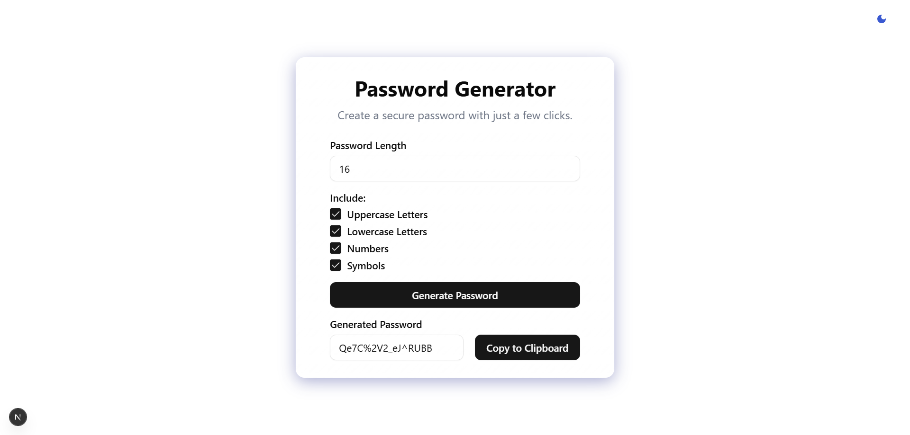

# Modern Password Generator

A sleek and secure password generator built with Next.js and TypeScript, featuring a modern glassmorphic UI design and real-time feedback.



## ✨ Features

- **Customizable Password Generation**
  - Adjustable password length (8-32 characters)
  - Toggle uppercase letters
  - Toggle lowercase letters
  - Toggle numbers
  - Toggle special symbols
  
- **Modern UI/UX**
  - Glassmorphism design with subtle animations
  - Dark/light theme support
  - Responsive layout for all devices
  - Real-time feedback via toast notifications
  - Clean and intuitive interface

- **Security & Convenience**
  - Client-side password generation
  - One-click copy to clipboard
  - Input validation and error handling
  - Secure random character selection

## 🚀 Tech Stack

- **Framework:** Next.js 14
- **Language:** TypeScript
- **Styling:** 
  - Tailwind CSS
  - CSS Variables for theming
  - Glassmorphism effects
- **UI Components:**
  - Radix UI primitives
  - Custom shadcn/ui components
- **State Management:** React Hooks
- **Notifications:** React-Toastify
- **Development Tools:**
  - ESLint
  - PostCSS
  - TypeScript configuration

## 🛠️ Installation

1. Clone the repository:
```bash
git clone https://github.com/osamabinadnan/password-generator.git
```

2. Install dependencies:
```bash
npm install
# or
yarn install
```

3. Run the development server:
```bash
npm run dev
# or
yarn dev
```

4. Open [http://localhost:3000](http://localhost:3000) in your browser.

## 💻 Usage

1. **Set Password Length**
   - Use the number input to set length (8-32 characters)

2. **Choose Character Types**
   - Check/uncheck boxes to include:
     - Uppercase letters (A-Z)
     - Lowercase letters (a-z)
     - Numbers (0-9)
     - Special symbols (!@#$%^&*()_+[]{}|;:,.<>?)

3. **Generate Password**
   - Click "Generate Password" button
   - Password will appear in the output field

4. **Copy Password**
   - Click "Copy to Clipboard" button
   - A success notification will appear when copied

## 🎨 Customization

### Themes
The application supports both light and dark themes, automatically detecting system preferences. You can toggle between themes using the theme switcher in the top-right corner.

### Styling
The UI is built with Tailwind CSS and custom CSS variables, making it easy to modify:
- Colors
- Shadows
- Border radius
- Animations
- Spacing

## 🤝 Contributing

1. Fork the repository
2. Create your feature branch: `git checkout -b feature/AmazingFeature`
3. Commit your changes: `git commit -m 'Add some AmazingFeature'`
4. Push to the branch: `git push origin feature/AmazingFeature`
5. Open a Pull Request

## 📝 License

This project is open source and available under the [MIT License](LICENSE).

## 🙏 Acknowledgments

- Design inspired by modern glassmorphism trends
- Built with [Next.js](https://nextjs.org/)
- UI components from [shadcn/ui](https://ui.shadcn.com/)
- Icons from [Lucide](https://lucide.dev/)

## 📈 Future Improvements

- Password strength indicator
- Custom character sets
- Password history
- Password strength requirements
- Save favorite configurations
- Export/import settings
- PWA support